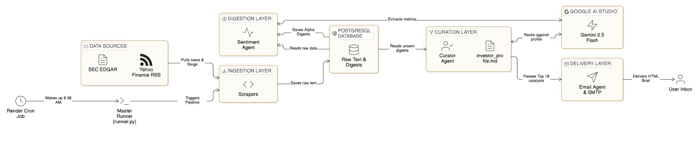

# 📈 TradeAlign-AI

An autonomous, end-to-end GenAI quantitative research pipeline. This system scrapes raw financial data, digests it using Google Gemini's batch processing, curates the insights against a specific investor profile, and emails a formatted HTML pre-market brief directly to your inbox.


## 🏗️ Architecture Overview

The pipeline executes daily in five distinct phases:

1. **Ingestion Layer (Scraping):** Pulls macroeconomic news (Yahoo Finance RSS), tracks institutional moves (SEC Edgar Form 4s/10-Ks), and fetches YouTube earnings call transcripts.
2. **Database Foundation:** Stores raw scraped data in a Dockerized PostgreSQL database using SQLAlchemy to prevent duplicate processing.
3. **Digestion Layer (Gemini Flash):** Uses Google `gemini-2.5-flash` with **Batch Processing** and Pydantic structured outputs to extract core metrics (EPS, Revenue) and sentiment scores from massive text payloads.
4. **Curation Layer (Gemini):** An AI Portfolio Manager evaluates the digested news against a custom `investor_profile.md` and ranks the top 10 most critical market movers.
5. **Delivery Layer:** Formats the curated data into a responsive HTML email and securely sends it via Gmail SMTP.

 

## 🛠️ Tech Stack

* **Language:** Python 3.11+
* **Package Manager:** `uv` (Astral)
* **Database:** PostgreSQL & SQLAlchemy (ORM)
* **AI & LLMs:** Google GenAI SDK (`gemini-2.5-flash`)
* **Deployment:** Docker & Render (Infrastructure as Code)

## ⚙️ Prerequisites

Before running the project locally, ensure you have the following installed:
* [Docker Desktop](https://www.docker.com/products/docker-desktop/) (for the database)
* [`uv`](https://github.com/astral-sh/uv) (for lightning-fast dependency management)
* A [Google Gemini API Key](https://aistudio.google.com/)
* A [Gmail App Password](https://support.google.com/accounts/answer/185833?hl=en)

## 🚀 Local Setup & Installation

**1. Clone the repository and navigate to the project directory:**
```bash
git clone https://github.com/Taqreem-k/TradeAlign-AI
cd financial-alpha-radar
```

**2. Configure Environment Variables:**
Create a .env file in the root directory and add the following credentials:

```bash
# Database Configuration
DB_USER=postgres
DB_PASSWORD=supersecretpassword
DB_NAME=alpharadar
DB_HOST=localhost
DB_PORT=5432
DATABASE_URL=postgresql://${DB_USER}:${DB_PASSWORD}@${DB_HOST}:${DB_PORT}/${DB_NAME}

# API & Email Credentials
GEMINI_API_KEY=your_gemini_api_key_here
SENDER_EMAIL=your_email@gmail.com
EMAIL_APP_PASSWORD=your_16_digit_app_password
RECEIVER_EMAIL=your_email@gmail.com
```

**3. Install Dependencies:**
Use uv to install all required packages from the pyproject.toml / uv.lock file:

```bash
uv sync
```

**4. Start the Database:**
Spin up the local PostgreSQL container in detached mode:

```bash
docker compose up -d
```

**5. Run the Integration Test:**
Execute the master diagnostic script to verify all 5 phases run successfully:

```bash
uv run python test_integration.py
```


## ☁️ Deployment (Render)
This project is configured for seamless deployment on Render using Infrastructure as Code (render.yaml).

Connect your GitHub repository to Render.

Go to Blueprints -> New Blueprint Instance and select this repo.

Render will automatically provision a managed PostgreSQL database and a daily Cron Job scheduled for 8:30 AM EST (13:30 UTC).

Important: Add your GEMINI_API_KEY, SENDER_EMAIL, and EMAIL_APP_PASSWORD to the Environment Variables tab in the Render dashboard for the Cron Job service.

---

##  Author

**Mohammad Taqreem Khan**